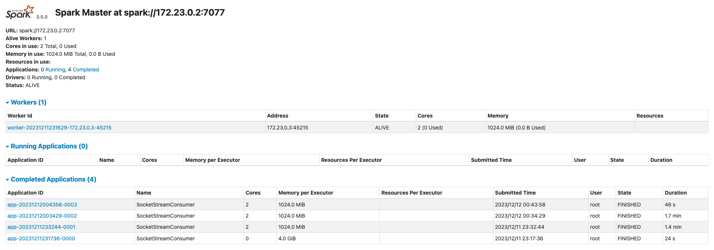
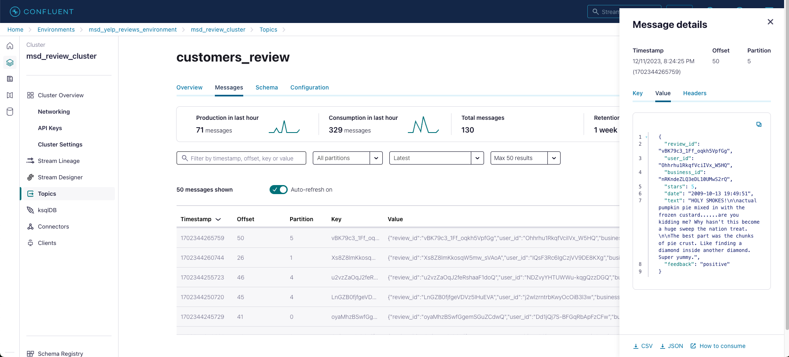
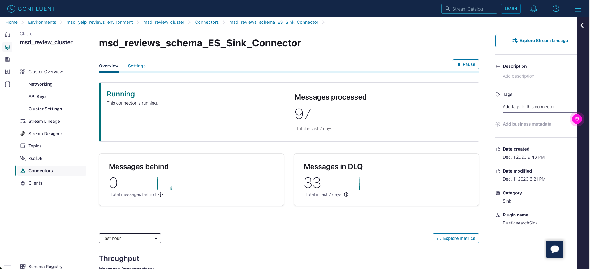
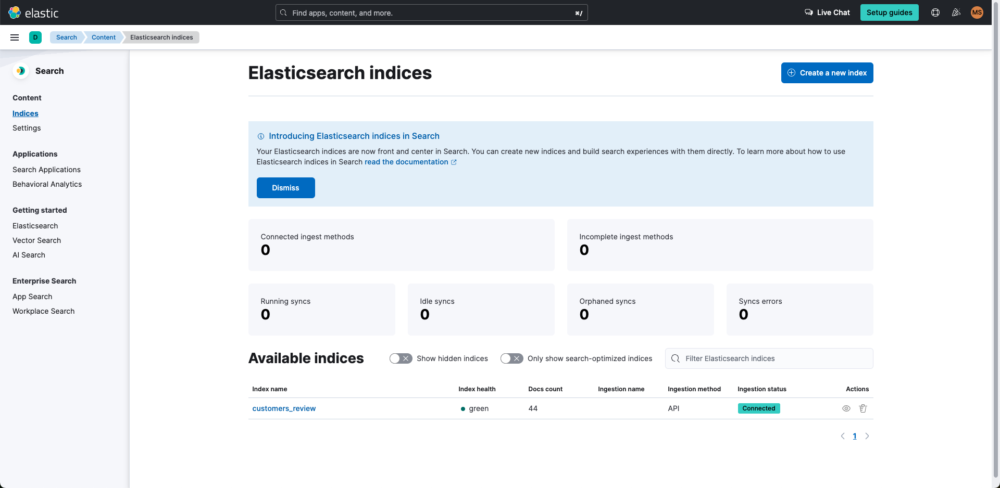
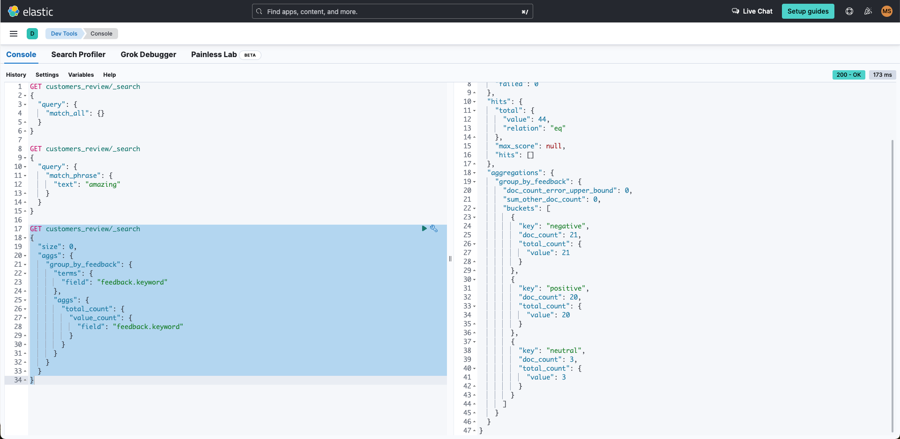

# Yelp Customer Review Data Stream Data Pipeline Project

This is a real-time data streaming pipeline that utilizes a 7-million-record Yelp Review dataset. A TCP/IP socket stream is created using Apache Spark and is used to stream review data from our static dataset to Apache Kafka, managed in Confluent.
These reviews are then run through NLTK Vader's large language sentiment analysis model to classify reviews as positive, negative, or neutral.
Analyzed reviews review data is then distributed within Elasticsearch via Confluent Connector for final visualization.

Project composed with aid from tutorial ["Realtime Socket Streaming with Apache Spark | End to End Data Engineering Project"](https://www.youtube.com/watch?v=ETdyFfYZaqU) by Yusuf Ganiyu.

### Apache Spark Master/Worker Connection

### Kafka/Confluent Topic and Connector

### Elasticsearch Index Creation and Queries

